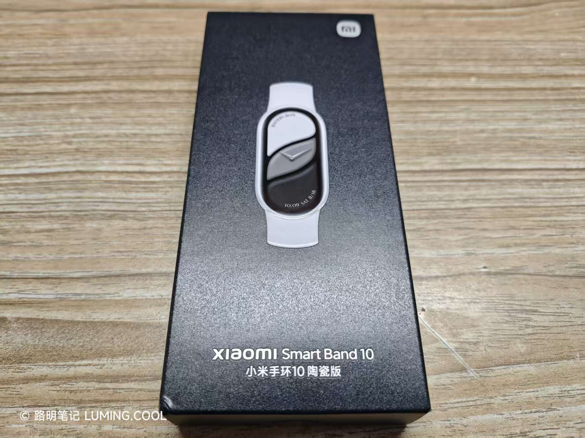

写完之后回来看看，忽然发现这篇文章没什么意义，只是把 2025 年发过的文章理了一遍。

所以，亲爱的朋友，你可以直接跳到[我想对你说的](#愿)。

2025 年，这一年发生在我身上的事太多了，足以让我回味好长时间。

# 一月 | January

- 我参加了[洛阳理工附中的领军班考试](/posts/2025/01/weekly-1-1/#%E9%80%86%E9%A3%8E%E7%BF%BB%E7%9B%98)，结果遗憾落榜。
- 我忘记了我的 WordPress 后台密码，于是边学边撰写了 [WordPress 密码修改教程](/posts/2025/01/wordpress-database-edit/)。

# 二月 | February

- 我的网站后台被[莫名入侵](/posts/2025/02/terrifying-website-attack/)。
- 借助 AI 的协助，我完成了第一个个人项目：[写作书RStatus](/posts/2025/02/new-project-rstatus/)，这是一款个人活动公开工具。
- [阅读了《活着》](/posts/2025/02/winter-holiday-summary/#读书)。文章中写自己“只读了133/216页”，但我实际上已经读到末尾了，这本书有好几十页都是后记。
- 买了本[写作游戏书](/posts/2025/02/winter-holiday-summary/#写作书)，但并没有坚持下来。
- 域名被 Bing 等搜索引擎屏蔽，于数月后自动恢复。
- 2024 年的[处分被撤销](/posts/2025/02/weekly-2-2/#处分撤销)。
- 九上期末考试成绩优异，获得 [500元奖学金](/posts/2025/02/weekly-2-2/#奖学金)。
- 购入 [REDMI Watch 5 eSIM](/posts/2025/02/weekly-2-2/#redmi-watch-5-esim)。

# 三月 | March

- 在信息技术考试备考过程中，我嫌无聊，便找了个工具把极域破解了，顺便写了一篇[教程](/posts/2025/03/jiyu-trainer/)。

# 四月 | April

- 进行了[物化生实验和信息技术模拟考试](/posts/2025/04/weekly-4-1/#实验信息技术模拟考试)。
- 进行了[物化生实验和信息技术正式考试](/posts/2025/04/weekly-4-2/#实验信息中招)，满分。
- 完成了[入团准备](/posts/2025/04/weekly-4-2/#入团)。

# 五月 | May

- 进行了[体育中招考试](/posts/2025/05/weekly-5-1/#体考)。
- 枯燥的[中招备考](/posts/2025/05/weekly-5-2/)。
- [编程比赛获奖，成功入团](/posts/2025/05/weekly-5-3/)。

# 六月 | June

- 购入 [MacBook Pro](/posts/2025/06/weekly-6-1/#古早苹果设备)。
- 购入 [iPhone 5s](/posts/2025/06/weekly-6-1/#iphone5s)。
- [中考](/posts/2025/07/summary-of-the-final-test/#中考)。
- 购入 [REDMI Turbo 4 Pro](/posts/2025/07/summary-of-the-final-test/#新手机)。

# 七月 | July

- 因实在无法忍受辅导班网课软件的强制置顶机制，我写了一个软件[破解了该机制](/posts/2025/07/dev-huomiao-debugger/)。
- 应母亲的书法班教学需求，我利用 AI 制作了一款[田字格生成器](/posts/2025/07/dev-tzg-creator/)。

- [武汉六日游](/posts/2025/07/travel-to-wuhan/#武汉六日游)。
- 网站[搬迁至大陆，套上 CDN，速度显著增强](/posts/2025/07/travel-to-wuhan/#网站升级)。
- 很遗憾，中考[无缘第一志愿](/posts/2025/07/travel-to-wuhan/#落水)。**道法这一科，批得太诡异了。**

# 八月 | August

- 开发了自己的第一款 [Vela 快应用](/posts/2025/08/summary-of-summer-holiday/#vela-开发初体验)。
- [七天军训](/posts/2025/08/summary-of-summer-holiday/#军训七天)。当时很难受，但真正上了高中以后才觉得那时候无忧无虑，挺好。
- [解析了小米澎湃 OS 3 发布会](/posts/2025/08/what-is-new-in-xiaomi-hyper-os-3/)。
- 撰写[小米 Vela 快应用开发简要教程](/posts/2025/08/build-a-quick-app-for-vela-devices/)。

> 澎湃 OS 3 发布会 和 Vela 教程 这两篇文章都落笔于开学前，源于我上高中前的极限表达欲。
>
> 哈哈，其实高中也没那么可怕。

# 九月 | September

高中开学以后，就几乎没有什么人生大事了，全是琐事。

我遇到了一位长得像熟人的[音乐老师](/posts/2025/09/weekly-9-2/#音乐老师)，强烈谴责了学校的离谱校规（虽然已经删了），观看了电影[《731》](/posts/2025/09/weekly-9-3/#731)。

# 十月 | October

- [第三次更换域名](/posts/2025/10/change-domain-3rd/)—— luming.cool，使用 Astro 系统进行建站，托管于 Github Pages。（当然，目前托管于 Vercel）
- 在国庆假期头一天，[通宵剪辑了一个视频](/posts/2025/10/national-holiday-summary/)，是给学校剪的。
- 讽刺了学校[形式主义的作业检查方式](/posts/2025/10/fake-sz-true-xs/)。
- 青桐鸣大联考，[我的成绩突飞猛进](/posts/2025/10/examination-2nd/)。
- 意外患上水痘，被迫居家隔离两周。

# 十一月 | November

- 开源了[我这几年来制作的软件](/posts/2025/11/open-source-sorts-of-software/)，包括 RStatus、火苗调试器、Poster、田字格生成器等。
- 再度回答[独立博客自省问卷](/posts/2025/11/blog-self-reflection/)。
- 购入 TicWatch Pro 3，使用一周后卖掉了。

# 十二月 | December

整个十二月，我都保持着一种非常忙的状态。课是很难懂的，题是做不对的，作业是海量的。只有一件事值得分享，那就是……

我用我攒的钱给我姐买了一个小米手环 10 陶瓷版！自己买的！

# 愿…

2025 年，有遗憾，也有惊喜。

明年，迎接我们的一定是更美满的生活，更美好的事业，更好的自己！
