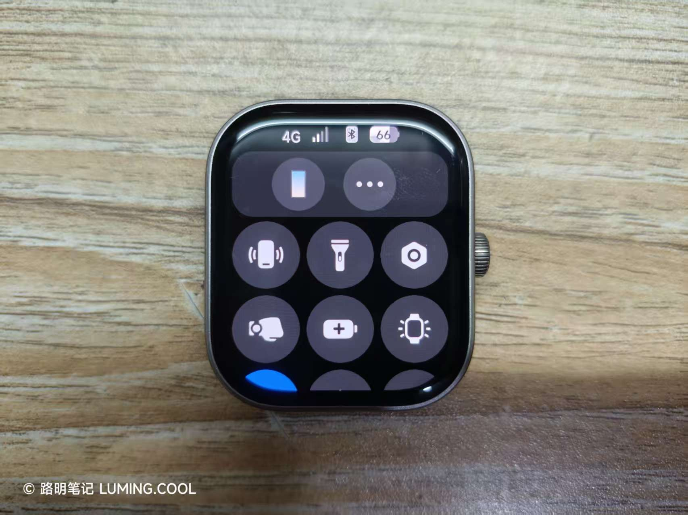
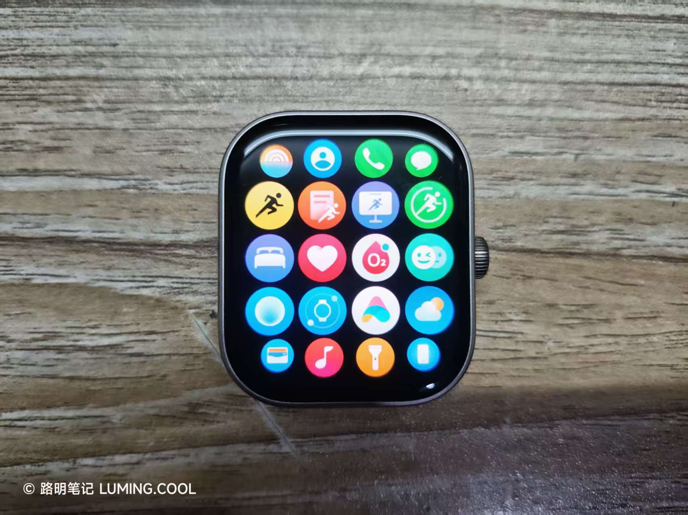
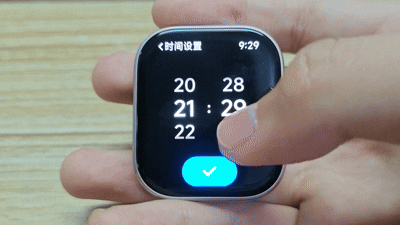

# 写在前面

蓝牙版 OS 3 全量包：[点我下载](https://cdn.cnbj0.fds.api.mi-img.com/miio_fw/ccf198b6d07bf92f94329542ddf4e0c2_upd_miwear.watch.o65.bin?GalaxyAccessKeyId=5721718224520&Expires=1779851618348&Signature=C/4dzBaS1geB6IxxAmSfr5tM25A=)

eSIM 版 OS 3 全量包：[点我下载](https://cdn.cnbj0.fds.api.mi-img.com/miio_fw/17ad98b2c5018e1fb0e9c70fbb54bdff_upd_miwear.watch.o65m.bin?GalaxyAccessKeyId=5721718224520&Expires=1779868079167&Signature=oS58jLRTY8Hu8TxR4SYwWBok7YE=)

有尝鲜需求的朋友可以自己下载安装，米坛社区有教程。

如果包失效了，那就不用费力找了，静等官方发包吧，不缺这一个月。

# 更新点

使用一周后，我能够感受到的更新点有：`系统图标变化`、`应用列表到小组件页动画调整`、`时间选择器动画速率调整`。

## 系统图标变化

这一点最容易看出来。首先，控制中心的系统图标（如电池等）都变成了 OS 3 的风格；其次，应用列表中，系统自带应用的图标部分进行了重绘。

## 应用列表到小组件页动画调整

感觉动画速率明显减慢。并且，似乎改成了非线性动画，更优雅了。

## 时间选择器动画速率调整

这是我认为这个版本最大的更新，也是我认为这个版本最值得升级的点。

使用 REDMI Watch 5 系列的用户，肯定都经历过设闹钟的时候选择器一划就停不下来的情况。

在 OS3 中，时间选择器的动画速率被调快了，与之前的版本相比，这一版设闹钟的时候能够体验到即时响应的快感。

# 最后...

其实 Watch 5 系列还有一个更新：**手动更新星历**。它长这样：

在听说这个功能时，我还以为是为 eSIM 用户提供了手机断连时的流量更新星历方案，结果还是令人失望——只能蓝牙连接手机时才可以手动更新星历。

REDMI Watch 5 系列的 OS 3，只能说是一个换皮的 OS 2，系统应用界面没有丝毫变化，只变动了图标和少部分动画。也许，小米已经放弃了这款产品吧。
