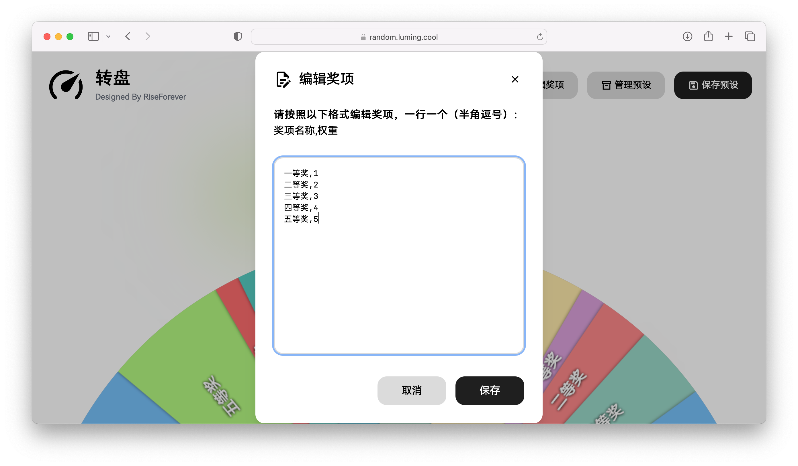
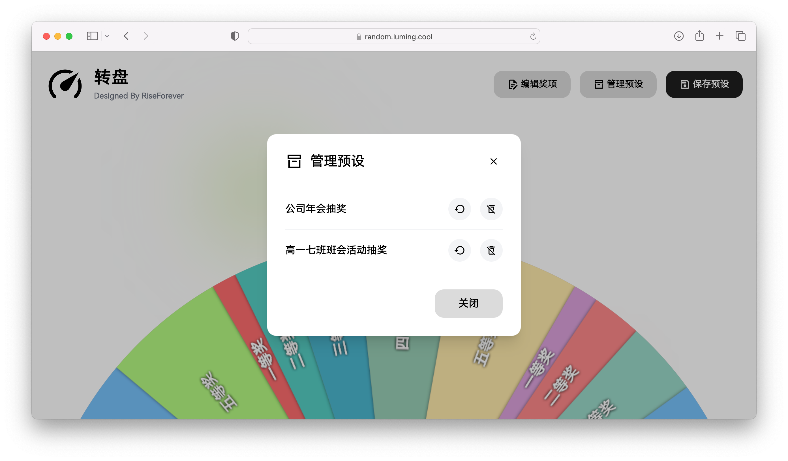

我们班有一个传统——每周班会课上，老师会允许量化积分排名前五的同学随机抽取一项奖励。

其中有一些奖项，比如"免作业"，需要比其它奖项更难被抽到。此时就要使用带有权重功能的抽奖工具了。**但是**，目前市面上的抽奖工具普遍不符合我的审美，而且带有权重功能的抽奖工具太少了，还都或多或少地有嵌入广告，十分烦人。

既然网上的不能满足我的需求，那就……自己做一个！

接下来向您介绍，由我设计界面，由 AI 编写逻辑代码做出的 HTML 作品——转盘。

---

# 界面

采用上下结构，上方是一系列自定义设置，下方是显示一半的转盘。

转盘只显示一半这点学习了 OPPO Lab 里的抽奖程序。

# 介绍

首先，转盘可以带权重抽奖。由于权重不是按照百分制计算，所以各个奖项的权重之和不一定是 100，你甚至可以将某个奖项的权重设置为 2147483647。

用户可以将当前的一组奖项保存为预设，以便在特定场景快速恢复及使用。

预设会以 Cookies 方式保存在用户的电脑中。保存数量无上限。

然后就没了。就是这么简单。

# 结语

欢迎线上体验：[https://random.luming.cool/](https://random.luming.cool/)
