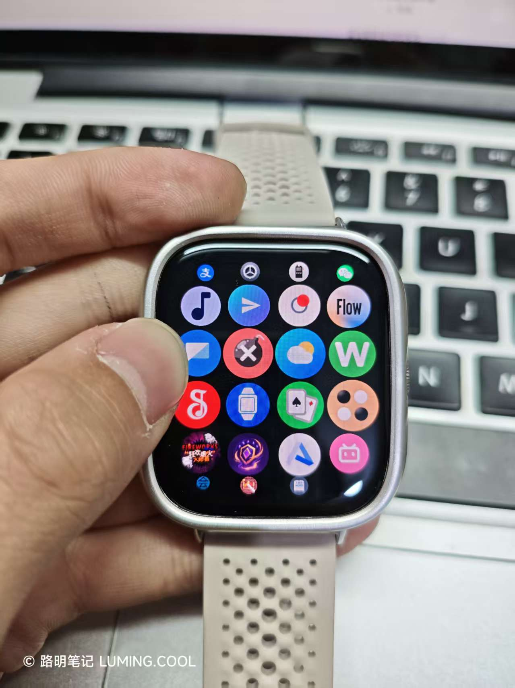

## 前情提要

> 本文所提供的固件包为 REDMI Watch 5 eSIM 的 HyperOS 3.110.029 版本。

> 本文与以往任何的探究笔记都不同。这是一套完整的解决方案。希望你可以耐心看下去。

众所周知，REDMI Watch 5 （含 eSIM 版）在某次大版本升级后，无法再安装任何快应用。

[USER=276123]@sensen1234[/USER] 大佬对[此现象的解释](https://www.bandbbs.cn/threads/18566/)是：

> 因为现在手表芯片被挖出来了为xring 所以米紧急更新了（大概率是）新的固件，限制了小程序安装

但是，在与 Manus 进行交流后，我发现，这并不是因为什么 Xring 芯片被挖出，只是一个简单的分区容量问题。

## 原理

小米 Vela 穿戴设备的 OTA 更新包里包含着许多分区。其中有一个分区，名为“vela_quickapp”，里面存放着系统预装的快应用 rpk 包。在系统更新或恢复出厂设置后，该分区里的快应用会被重新安装到系统中。

而**vela_quickapp中的应用**，在用户层面是**无法被完全删除的**，Vela 系统中提供的“卸载系统应用”只是**起到“隐藏”的效果**，实际上该应用的 rpk 包仍存在于 vela_quickapp 分区内，在恢复出厂设置后会自动装回来。

vela_quickapp 分区的大小是**固定的**，大约为 **8MB**。**若该分区被撑满，就无法继续安装快应用。**（也就会出现安装时提示“存储空间不足”的情况）

这样，“更新固件后无法再安装快应用”的问题就很好解释了。只是因为**小米往 vela_quickapp 分区里塞了一堆小游戏 rpk**，导致该分区**在系统更新后直接被撑满**，且**内置的小程序无法被删除**，所以无法继续往里面安装任何快应用。

## 解决

知道了问题发生的原因，那么我们直接对症下药就行了。

我把 REDMI Watch 5 eSIM 最新版的 OTA 升级包发给了 Manus ，让他删除了 vela_quickapp 分区内的所有预置快应用，除了微信。（因为微信里有微信支付是生活必需的）

最后，让他把固件包重新打包发给我，这么一项修改算是完成了。

使用 Notify For Xiaomi 将固件包安装到手表上，完美开机。恢复出厂设置后，系统中只有微信这一个快应用。“系统应用安装”列表也干净了。

使用 AstroBox 向手表中安装快应用，果然可以安装，这说明小米并没有在系统层面设置什么快应用安装的“限制”。

最后实测，安装不同种类的快应用，安装了 20 个之后才提示存储空间不足。比使用普通固件的 10 个左右多出了不少。

## 警告

前文提到了 _vela_quickapp 这个分区的大小是固定的_。这时候有些同学可能会说：“**那我把这个分区扩容不就好了？**”

**这是一个很危险的行为。**我在摸索出“删快应用法”之前，曾让 Manus 给 vela_quickapp 分区扩过容。但是扩容后的固件一装到手表上，**手表就变砖了。**为此我和小米售后磨了好久嘴皮子才换了块新表……

## 固件分享

REDMI Watch 5 eSIM 版的包[点击我](https://www.123865.com/s/3ZVRVv-3FZ3A)下载。

其它型号的包我没做，因为 Manus 免费版积分用光了。（悲）

如果大家真的有需要的话，欢迎在这条帖子下评论，我会选择性地做包并分享给大家。
