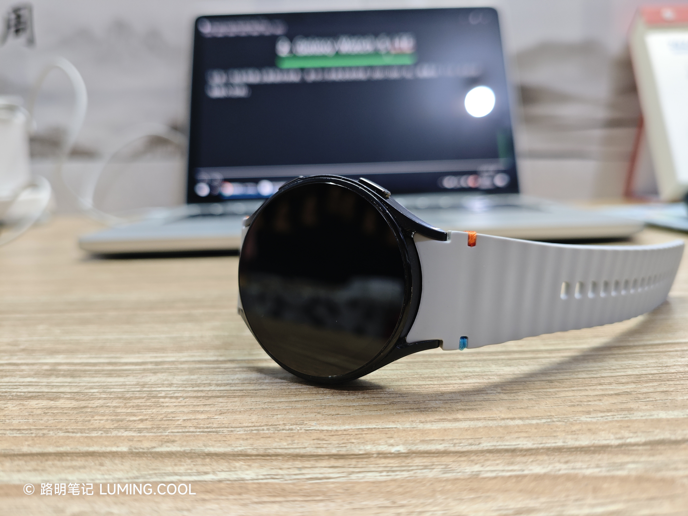

# 前言

> 这篇文章本是 1 月 16 日撰写的，写了一半就偷懒停笔了，现在才写完😂

小学六年级，我迷上了华强北的全智能手表，只可惜母亲坚决不愿意给我买，说是耽误学业。

初二那年，我在小米手环 9 发售的时候买了小米手环 8。它功能很少，只能依靠为数不多的官方小游戏表盘来娱乐。

初三那年，我用奖学金买了一块 REDMI Watch 5 eSIM。它很完美。它可以打电话，可以听歌，可以安装第三方快应用和小游戏，550mAh 的电池可以支撑我一周的使用。

高一，我开始接触闲鱼，并先后购买了 TicWatch Pro 3 和 Samsung Galaxy Watch 5 LTE。我喜欢前者的双屏设计，但它“不支持开通 eSIM”；我喜欢后者的系统动效，但其“开通了 eSIM 后只有半天的续航”。最终，我又回到了 REDMI Watch 5 eSIM。我认为，轻智能手表才是住宿学生的最佳选择。

---

# Tic Watch Pro 3

这块手表令我印象深刻，我还为它[写过一篇文章](/posts/2025/11/tic-watch-pro-3/)。里面提到：

> **eSIM**：虽然它理论上支持 eSIM，但只支持**线下扫二维码下载数据**，而这种开通方式早已被时代淘汰。所以，它现在没法开通 eSIM。

当时我去了本地的一家中国联通营业厅，要求开通 eSIM，但是工作人员没受理过这种业务，也没受过这类业务培训。她并没有选择现场学习，而是编造了一个理由：“二维码开卡的形式早已被时代淘汰”。

彼时的我还太天真，对工作人员的话深信不疑，认为 TicWatch 没有开通 eSIM 的途径了。于是它就失去了留在我手里的意义，我就将其挂在闲鱼上卖掉了。

# Galaxy Watch 5 LTE

这是一块在闲鱼上很流行的表，至今二手成交价仍在 200~300 元。我是以 116 元的价格购入它的。

卖家向我描述的成色是“伊拉克成色”，但由于它的屏幕是蓝宝石材质的，所以它整体看起来仍十分精致，并没有岁月带来的粗糙感。

收货时这块手表的系统是 OneUI 5.0。我在到货第二天就兴致冲冲地给它开通 eSIM，却被中国联通 APP 拒之门外——该设备支持的 eSIM 协议太老了，不支持在营业厅 APP 自助开通。

而当时的我，认知还停留在给 TicWatch Pro 3 开通 eSIM 时店员告诉我的“二维码开通法已淘汰”，信誓旦旦地认为“我只能在营业厅 APP 上手动开通 eSIM。如果不行，那就是我自己的问题。”于是，我在学校连着班里一体机的热点，开始尝试给这块手表 OTA 升级系统。

令我意外的是，三星居然给这块 2022 年的表一直提供更新到 OneUI 8，Android 16。~~（某粮厂开发部员工，赶紧向人家三星学学）~~**但是**，即使更新到了 OneUI 8，这块手表依然无法通过营业厅 APP 自助开通 eSIM。🤡

冷静下来后，我发现这块表变得奇卡无比，且续航也崩溃到了半天一充。

我开始询问网友——“三星手表能不能降级？”，得到的回复是“可以，但找刷机包很难。”

于是我开始全网翻找，最终只找到了两个可用的固件源——都是 OneUI 5.0 的固件包，一个卖 40 刀，一个卖 60 刀。

> 这都够我再买两块一样的表了好吗？

我彻底放弃了给手表降级的念头，又开始研究如何给手表开通 eSIM。就在这时，一通打给 10010 的电话点醒了我——原来二维码开通法从未被淘汰，只是现在大多数小营业厅的员工都懒得使用。

于是我开始“打卡”我家附近的每一家联通营业厅。终于，在某个人来人往的街道旁的联通营业厅，一位年长的阿姨接待了我。

在听到我口中的“eSIM 二维码开卡”一词后，她沉默了——她也没听过这个陌生的操作。但，与其他店员不同的是，她拿出了手机，拨给了她的上级领导，询问这个业务的操作方法。终于，在上级的解释和我的协助下，她找到了后台中那条不起眼的超链接——“eSIM 开卡”。

找到业务入口后，我和她都松了一口气。接下来的步骤就简单了。我将我手表的 IMEI、MEID 报给了她，在后台完成了一系列操作后，她的屏幕上出现了一个二维码——我拿起手机扫描，随即屏幕上显示出“China Unicom”的字样。我点击“确认下载”，过了约 2 分钟，手表屏幕上亮起了四格信号。

---

在开通了 eSIM 后，我十分兴奋——“我以后在学校就不止可以打电话、发短信了，我还可以尽情摸鱼，探索无限的可能性！”但是，现实很打脸。

我是寄宿生，每周五下午 4 点放学后，还需要接受“自愿”留校直到周六下午 4 点。开通 eSIM 后的第一个周五，放学后，我如脱缰的马，跑到校外的小饭店买了一份肉合，又快速回到了班级。不为别的，就为刷那么十分钟的 BiliBili。在经历了一周的封闭生活后，能够在留校期间与这个世界进行一丝细微的接触，是我最开心的事。

但是，到了晚上回寝室，情况就不一样了——晚上 22:40，寝室强制断电，其他成员都带了手机在玩，而我举着一块不到一半巴掌大小的手表，吃力地看着那能看清像素点的“高清”屏幕，感觉眼睛都要瞎了。**那天晚上，我只看了十分钟，就睡了。**而其他人，有的熬到了 2 点，有的熬到了 4 点，总之，Watch 5 LTE 在某种程度上起到了戒网瘾的作用——谁会愿意在那么小的屏幕上看视频呢？

---

又过了一周，我实在无法忍受 Watch 5 那半天一充的续航，便将它的 eSIM 转移到了我原本的 REDMI Watch 5 eSIM 上。

而这块表？￥150 卖给同学了。（含泪试用两周，再反手赚个 30 块，哈哈）

# 总结

根据我自己的经历，我认为，对于高中在读寄宿生，轻智能手表也许可以成为你的最好选择。因为轻智能手表具有相对完善的功能和极低的功耗（极长的续航），它能够最大程度上减少因充电等操作而耽误的在校时间。

全智能手表，功能确实多。但是，你又怎么确定你有时间去玩它呢？高中学生周内学习如此紧张，谁会（或是敢）在课堂上拿出手表把玩？

因此，购买一块轻智能手表吧。它在轻微满足娱乐需求的同时，也能完美满足在校的对外通讯需求。
