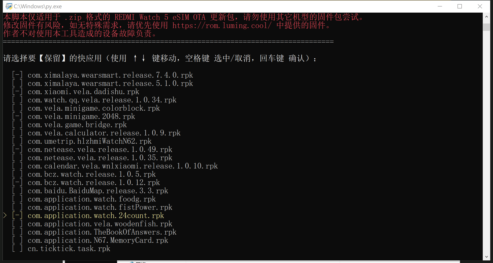

# 前言

> 这条帖子更新得很突然。原本我是在写一个一站式自定义固件脚本的，中途我想要在帖子里和读者说明“删了预置快应用后仍有安装限制”的客观原因，所以我去问询 AI。不问不知道，一问吓一跳。在 AI 的启发下，我做了个实验，发现**限制快应用数量的并非物理分区大小，而是系统底层逻辑。**
>
> 所以，本帖就变为了教程帖兼探究帖。
>
> 在快应用数量限制**被彻底攻破之前**，您可随时通过本帖**获取最新的解除快应用数量限制方案**。

> 固件修改有风险，对于不了解 Vela 安全机制的朋友切勿尝试，以防变砖！
>
> 感谢[P同学](https://www.bandbbs.cn/members/130371/)对本项目的鼎力支持。

今年 1 月 10 日，我发布了一条帖子——[《彻底解决 REDMI Watch 5 eSIM版快应用数量限制问题及其原理解读》](https://www.bandbbs.cn/threads/24602/)，里面提及了新固件无法安装快应用的原因及解决方法。

在那条帖子中，我说：

> vela_quickapp 分区的大小是**固定的**，大约为 **8MB**。 **若该分区被撑满，就无法继续安装快应用。**（也就会出现安装时提示 “存储空间不足” 的情况）

但是，2 月 12 日我做了一个实验——在安装了“删小程序”版固件的前提下，我先是往手表里装了十几个体积很大的 .rpk 包（实际装进去的安装包总大小约为 **_13.3MB_**），发现**完全可以正常安装**。直到装了大约 **19** 个之后，设备开始返回“空间不足”的信息；然后，我将手表恢复出厂设置，又找了 22 个体积很小的 .rpk 包（总体大约 5.3MB），发现装到约 **18** 个的时候，设备就开始返回“空间不足”的信息。

这个现象很有力地反驳了我那篇帖子的观点“这是分区容量问题”。很明显，REDMI Watch 5 eSIM 的固件里，有一个**类似于“快应用总数限制”的机制**在捣鬼。

而我那篇帖子里提供的“删除系统预置快应用法”**只是歪打正着，减少了快应用的总数，所以给用户腾出了安装第三方快应用的空间。**这也算是一种歪打正着、治标不治本的方法吧。😂

# 当下最新的“解除”快应用数量限制方法

## 是什么、怎么做（方法概述）

### **对于普通用户，或 Vela 新手小白：**

> **答：**仍是删除官方预置快应用法。

前往“[固件修改计划](https://rom.luming.cool)”官方网站，下载`REDMI Watch 5 eSIM 删除快应用版`固件，使用 **Notify For Xiaomi、AstroBox** 或其它软件**将固件安装到你的手表上**。安装完毕后，**将手表恢复出厂设置（必要）**，即可享受**自由安装大约 18 个快应用的快感**。

### **对于 Vela 大蛇 或 喜欢自定义的用户：**

> **答：**你可以使用 Python 脚本以实现**_自定义系统预置应用_**和**_修改系统字体_**的效果。
>
> Python 脚本**[点我下载](https://www.123865.com/s/3ZVRVv-h7Z3A)**。

我和 Manus 协作**编写了一个 Python 脚本**（我提供逻辑，Manus 编写代码），它长这个样子：

有了这个脚本，你可以**自行对官方固件进行修改**。目前包含**删除系统预装快应用**和**替换系统字体**两个功能。

经实测，REDMI Watch 5 eSIM HyperOS 3.110.029 固件，修改后可以完美刷入并进入系统。理论上其它版本的固件也可以实现上述两个功能。

但是**请切记**！该脚本**能且仅能修改 REDMI Watch 5 eSIM 的固件**！其它机型（**甚至包括 Watch 5 蓝牙版**）的固件结构和 REDMI Watch 5 eSIM 的固件结构大相径庭，**无法被脚本识别**！

脚本**无法保证每次生成的固件是 100% 可靠的**，尽管**我已尽力让脚本遵循 Vela 的固件安全校验机制**。修改版固件刷入后**极小概率会导致您的设备出现故障**，**作者不对此负责**。

对于不知道包名对应哪个软件的朋友，我来列一张表。

|                                          包名 | 软件名     |
| --------------------------------------------: | ---------- |
|      com.ximalaya.wearsmart.release.x.x.x.rpk | 喜马拉雅   |
|                   com.xiaomi.vela.dadishu.rpk | 打地鼠     |
|           com.watch.qq.vela.release.x.x.x.rpk | QQ音乐     |
|              com.vela.minigame.colorblock.rpk | 找色块     |
|                    com.vela.minigame.2048.rpk | 2048       |
|                      com.vela.game.bridge.rpk | 小人过桥   |
|         com.vela.calculator.release.x.x.x.rpk | 计算器     |
|                com.umetrip.hlzhmiWatchN62.rpk | 航旅纵横   |
|            com.netease.vela.release.x.x.x.rpk | 网易云音乐 |
| com.calendar.vela.wnlxiaomi.release.x.x.x.rpk | 万年历     |
|               com.bcz.watch.release.x.x.x.rpk | 百词斩     |
|            com.baidu.BaiduMap.release.x.x.rpk | 百度地图   |
|               com.application.watch.foodg.rpk | 今天吃什么 |
|           com.application.watch.fistPower.rpk | 拳力挑战   |
|             com.application.watch.24count.rpk | 24点       |
|           com.application.vela.woodenfish.rpk | 电子木鱼   |
|          com.application.TheBookOfAnswers.rpk | 答案之书   |
|            com.application.N67.MemoryCard.rpk | 记忆卡牌   |
|                          cn.ticktick.task.rpk | 滴答清单   |

## 为什么（原理、问题避坑）

**对于【固件修改计划】**：因为该设备搭载的 VelaOS **在底层限制了可安装的快应用总数**，所以我删除了`vela_quickapp`分区里的**全体系统预置快应用**（除了“微信”和“融合设备中心”）。这样虽不能从根源解决问题，但仍能有效提升可安装快应用的数目。

删除`vela_quickapp`分区里的**系统预置快应用**不会对手表的正常运行造成任何影响。因为该操作**不涉及代码修改**，仅为简单的“系统精简”操作。如果您**需要使用系统预置快应用**（如“网易云音乐”等），请前往**[该资源帖](https://www.bandbbs.cn/resources/5195/)**进行下载。

**对于【固件修改脚本】**：因为小米官方未对`vela_quickapp`和`vela_fonts`分区做特征校验功能，所以可以通过 Python 对这两个分区里的内容进行修改。

- 因为这两个分区都是 **romFS** 格式的**只读分区**，所以脚本对两个分区的操作流程都是`提取分区内文件`、`修改分区内文件`、`重新打包分区`。
- 对于字体的修改，使用了 **Fonttools** 库把任意 .ttf 格式的字体元数据**伪装成 MiSans**，以骗过系统中可能的字体名称检测。

**切记！你所修改的字体大小不能超过原 MiSans 字体的大小！否则可能会导致其它分区数据被覆盖，最终致使系统无法正常启动。**这一点我在脚本中做了校验，一旦发现字体大小超出范围就会拒绝修改并回滚操作。但在实际使用中还是请多注意！

# 当下快应用解限研究进展

无法攻破。至少在 vela_ap 分区层面无法排查到问题根源。后期我可能会继续排查，也欢迎有相同志向的朋友添加我的 QQ：3662302880，我们一起研究。

> ~~仅供参考。以下内容由 AI 生成。~~

~~上文我提到过，限制 REDMI Watch 5 eSIM（下称“该设备”）快应用安装数量的因素**在固件底层**。于是我和 AI（Gemini + Manus）由浅入深，探索了四种可能：~~

## ~~逻辑层：第一道报警哨卡 (13个限制)~~

~~这是最外层的限制，表现为系统在安装时主动弹窗拦截。~~

- ~~**发现因素：** 固件中存在 `CMP R1, #13` 指令。~~
- ~~**原理：** 系统在安装快应用前会查询当前已安装列表的计数（Count），如果该值大于 13，逻辑分支会直接跳转到报错流程。~~
- ~~**表现：** 弹出“存储空间不足”的虚假提示，虽然此时 Flash 空间其实非常充裕。~~
- ~~**解决方法：**使用十六进制编辑器，将`#13`修改为`#64`。意为“在逻辑上，将最大快应用安装数量改为64”。~~
- ~~**是否解决问题：否。**手表仍只能安装最多 20 个快应用。~~

## ~~物理校验层：第二道硬性防线 (20个限制)~~

~~即使绕过了 13 个的报警，系统在更深层的代码里还有一处针对“20”的硬性校验。~~

- ~~**发现因素：** 在安装器的核心逻辑区发现了 `CMP R0, #20` (0x14)。~~
- ~~**原理：** 这是一个“死命令”，用于验证当前处理的应用索引号。如果索引号达到 20，即使检票员（第一道哨卡）放行了，后台的记录员（安装执行逻辑）也会因为数值超限而拒绝执行。~~
- ~~**意义：** 这解释了为什么删除了内置应用、腾出了名额，却依然无法突破 20 个总数的原因。~~
- ~~**解决方法：**利用十六进制编辑器，将`#20`修改为`#99`。意为“在核心逻辑上，允许安装器接受 99 个快应用计数”。~~
- ~~**是否解决问题：否。**手表仍只能安装最多 20 个快应用。~~

## ~~数据结构层：跳转表与数组长度 (跳转表溢出)~~

~~这是最隐蔽、也是技术难度最高的一处限制。~~

- ~~**发现因素：** 发现了 `TBH` (Table Branch Halfword) 指令及配套的跳转表。~~
- ~~**原理：** 系统的快应用管理函数使用了一个 `switch-case` 结构的跳转表。这个表在内存中是**定长**的（只有 20 个条目）。~~
- ~~**后果：** 当尝试安装第 21 个应用时，程序会试图在跳转表中寻找第 21 个“座位”的地址。由于表长只有 20，程序会读取到表后的无关数据作为内存地址进行跳转，导致非法指令执行（Illegal Instruction）或系统保护性拦截。~~
- ~~**解决方法**：修改底层代码，将跳转表长度改为`64`。~~
- ~~**是否解决问题：否。**手表仍只能安装最多 20 个快应用。~~
